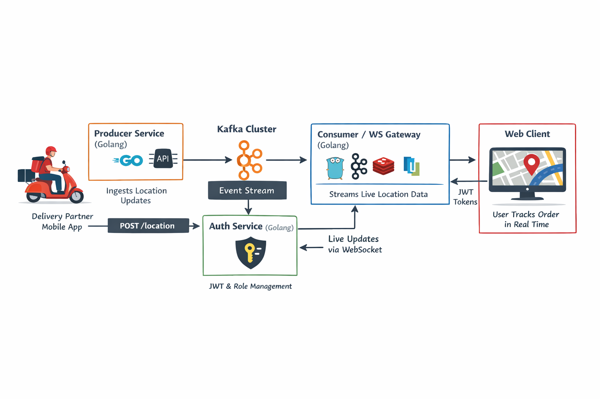

# 📦 Zomato Live Tracking System

A **real-time delivery tracking system** inspired by Zomato/Swiggy, built using an **event-driven architecture** with Kafka, Redis, WebSockets, and JWT-based authentication.

This project demonstrates how large-scale food delivery platforms stream live rider locations to end users reliably and securely.

---

## 🚀 Key Features

- Real-time rider location updates
- Event-driven architecture using Kafka
- WebSocket-based live updates to customers
- Redis-backed WebSocket routing
- JWT authentication with role-based access control (RBAC)
- Modular microservices design
- Scalable & production-oriented architecture


## 🧩 Services

| Service | Description |
|---------|------------|
| auth-service | User creation, login, JWT issuance, role management |
| producer | Receives rider location updates and publishes to Kafka |
| consumer | Consumes Kafka events and pushes updates via WebSocket |
| web-client | UI for users to track live delivery |
| kafka | Event streaming backbone |
| redis | WebSocket connection routing |

## 🧱 Architecture Overview




## 🔐 Roles & Authorization

| Role | Permissions |
|----|------------|
| ADMIN | Create users |
| DELIVERY_PARTNER | Send location updates |
| CUSTOMER | View live tracking |
| INTERNAL_SERVICE | Kafka consumers |

Authorization is enforced via **JWT middleware**.

---

## 🧪 How to Run the Project Locally

### 1️⃣ Prerequisites

Make sure you have:
- Docker & Docker Compose
- Go (version 1.20 or above)
- Git

---

### 2️⃣ Clone the Repository

```bash
git clone git@github.com:Shubham1826/ZomatoLiveTracking.git
cd ZomatoLiveTracking
```

### 3. Start Infrastructure (Kafka, Redis, Database)

```bash
docker-compose up -d
```
Verify that containers are running
```bash
docker ps
```

### 4. Create Kafka Tpoic (One Time Setup)
```bash
docker exec kafka kafka-topics \
--create \
--topic delivery.location.v1 \
--bootstrap-server localhost:9092 \
--partitions 3 \
--replication-factor 1
```

### 5. Start Backened Services
Open separate terminals for each service.

#### Auth Sservice
```bash
cd auth-service
go run .
```
#### Producer Sservice
```bash
cd producer
go run .
```
#### Consumer and WebSocket Service
```bash
cd consumer
go run .
```

### 6. Start Web Client
```bash
cd web-client
python3 -m http.server 5500
```
Open the application in a browser:
```bash
http://localhost:5500/index.html
```
### 7. Generate JWT and SEnd Location Update
Login using the auth-service to obtain a JWT for a user with the DELIVERY_PARTNER role.

Then simulate rider location update:
```bash
curl -X POST http://localhost:8080/location \
-H "Content-Type: application/json" \
-H "Authorization: Bearer <DELIVERY_PARTNER_JWT>" \
-d '{
  "partner_id": "dp1",
  "order_id": "order123",
  "lat": 12.97,
  "lng": 77.59
}'
```
The web client will receive live updates instantly via WebSocket.

## Design Decisions and Trade-offs

- Kafka provides durability and loose coupling between services

- Redis stores routing metadata (connection IDs), not live socket objects

- WebSockets enable low-latency real-time communication

- JWT avoids database lookups in high-throughput paths

- Hybrid Redis and in-memory model allows horizontal scaling

## Future Improvements
- Future Improvements

- ETA calculation service

- Route polyline visualization

- WebSocket auto-reconnect

- Refresh token support

- Kubernetes deployment

- API Gateway with rate limiting

- Metrics and tracing using Prometheus and Grafana